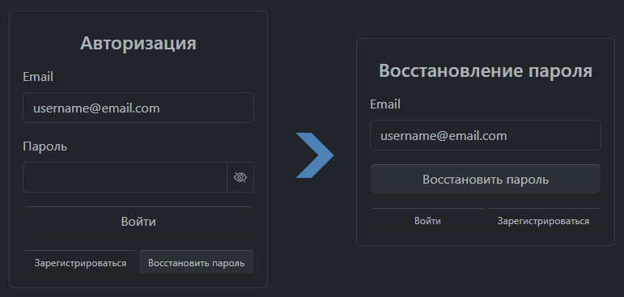
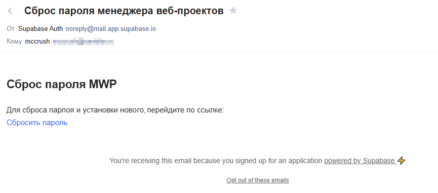
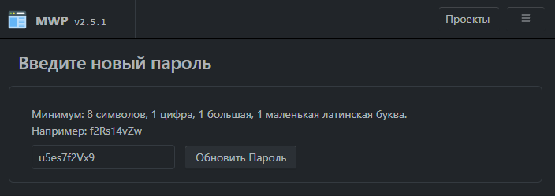

# Сброс и восстановление пароля

В случае утери пароля, вы можете самостоятельно обновить его на странице авторизации.

Нажмите на кнопку «Восстановить пароль» и введите адрес электронной почты, которую указывали при регистрации: 

На данный адрес придет письмо со ссылкой для сброса пароля:

Перейдя по ссылке и после автоматической авторизации, вы сможете ввести и сохранить новый пароль:

