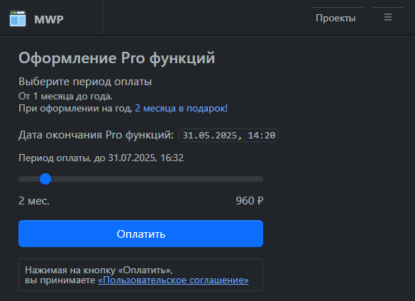
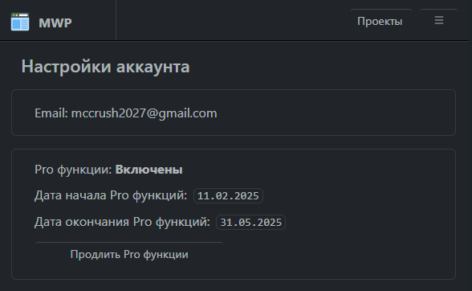

# Pro функции

### Оформление «Pro функций»

Вы можете выбрать желаемый период подключения «Pro функций», от 1 месяца до года:

При подключении «Pro функций» сразу на год, вы получаете скидку равную стоимости 2-х месяцев.

### Продление «Pro функций»

Для продления «Pro функций», необходимо перейти на страницу настройки аккаунта и в соответствующем разделе нажать на кнопку «Продлить Pro функций»:

<!---
### Отключение «Pro функций»

/** Отключить «Pro функций» можно в любой момент на странице настройки аккаунта в соответствующем разделе, нажав на кнопку «Отключить Pro функций». При этом «Pro функции» останутся доступны до конца оплаченного периода.

-->