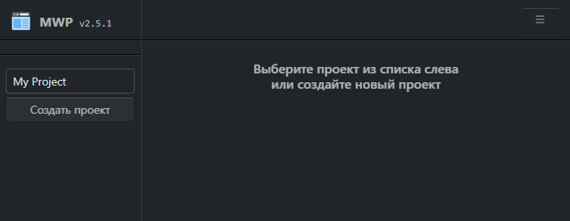
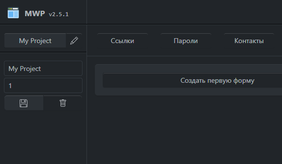
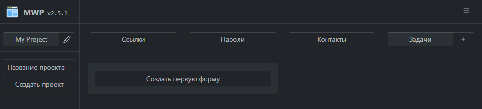
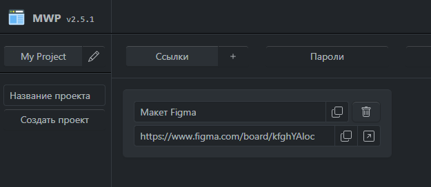

# Работа с проектами

### Создание нового проекта
Для создания проекта, в левой части страницы «Проекты» введите в текстовое поле название и затем нажмите на кнопку «Создать проект» (или нажмите клавишу Enter). Имейте ввиду, что максимальная длина имени проекта составляет 32 символа:

### Редактирование проекта
Для изменения имени проекта или его позиции в списке, кликните по проекту, чтобы слева от названия появилась кнопка «Редактировать» (иконка карандаша). После нажатия на кнопку «Редактировать», под списком проектов отобразится форма с информацией о проекте. Вы можете сохранить внесенные изменения нажатием на кнопку «Сохранить» (иконка дискеты), либо удалить проект (иконка корзины).

Обращаем ваше внимание на то, что при удалении проекта будет удалена и вся связанная с ним информация (ссылки, пароли, контакты, задачи) без возможности восстановления.

### Работа с формами
Справа от списка проектов расположены вкладки с определенными видами информации. Для переключения между ними, нажимайте на кнопки с соответствующим названием (ссылки, пароли, контакты, задачи):

Вы можете создать до 4 форм в каждой из вкладок (и 8 задач) с базовыми функциями, и 64 с профессиональным. Для этого нажмите на кнопку «Добавить форму» (иконка плюса). Отобразится пустая форма.

Обращаем ваше внимание, что длина вводимых данных ограничена следующими значениями:

|Название поля|Максимальное количество символов|
|--- |:---:|
|Название ссылки|32|
|Ссылка|256|
|||
|Название пароля|32|
|Ссылка на авторизацию|256|
|Логин|64|
|Пароль|32|
|||
|Имя контакта|32|
|Поле контакта|64|
|||
|Задача и подзадача|128|

Информация в формах сохраняется автоматически при потере фокуса вводимого поля.

Для удаления формы, нажмите на кнопку «Удалить форму» (иконка корзины). 

